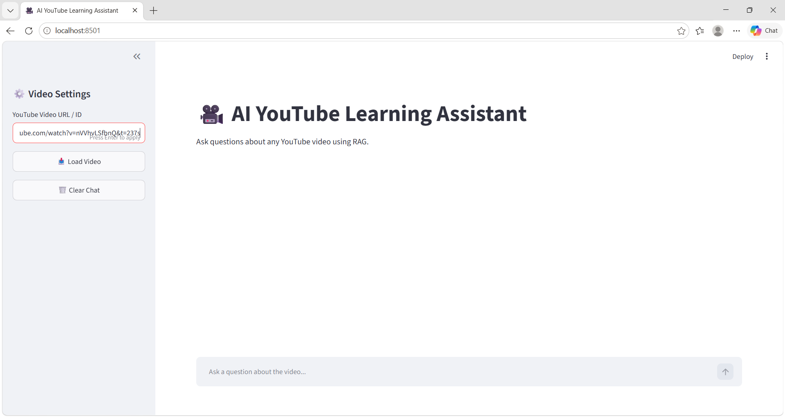
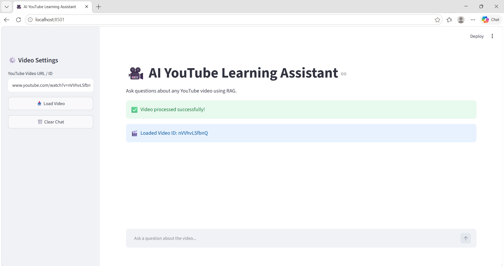
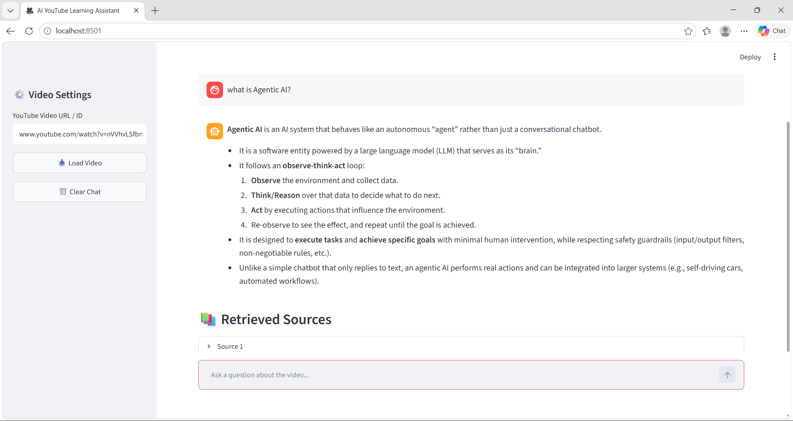
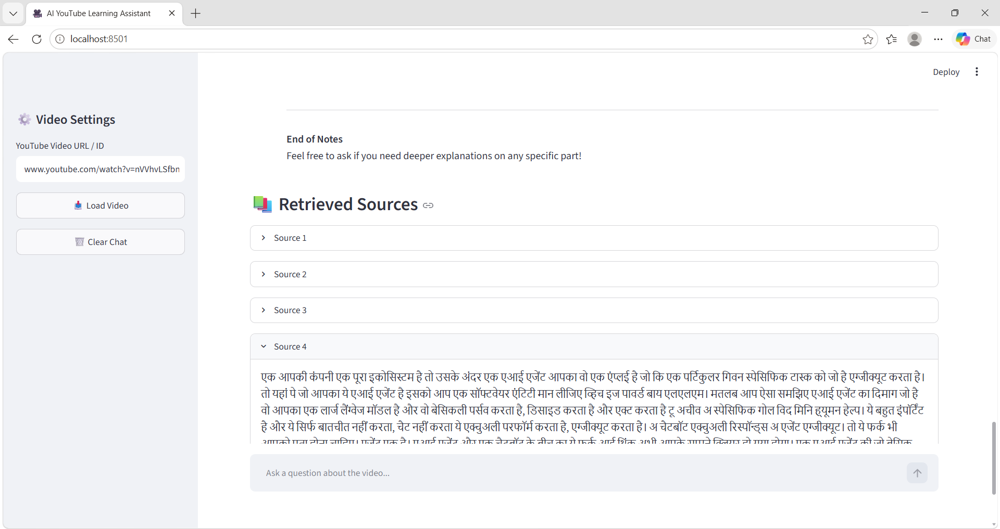

# 🎥 AI YouTube Learning Assistant

An AI-powered **YouTube Learning Assistant** that allows users to ask questions about a YouTube video's content and receive context-aware answers using **Retrieval-Augmented Generation (RAG)**.

The application extracts the video's transcript, splits it into meaningful chunks, converts the chunks into vector embeddings, stores them in **FAISS**, retrieves the most relevant content for a user's question, and uses a **Groq LLM** to generate an answer grounded in the retrieved transcript.

---

## 🚀 Live Demo
🚀 [Try the Live Demo]
https://ai-youtube-learning-assistant-fhyzdvrzmnrm3daidytsyu.streamlit.app/

---

## ✨ Features

* 🎥 Accepts a YouTube Video ID or URL
* 📝 Automatically extracts the YouTube transcript
* 🌐 Supports English and Hindi transcripts when available
* ✂️ Splits transcripts into smaller overlapping chunks
* 🧠 Generates local embeddings using HuggingFace Sentence Transformers
* 🔎 Performs semantic similarity search using FAISS
* 🤖 Generates context-grounded answers using a Groq LLM
* 💬 Maintains conversation history for follow-up questions
* 📚 Displays retrieved transcript sources
* 🖥️ Interactive Streamlit web interface
* ⚡ Caches the vector store to avoid unnecessary re-processing

---

## 🧠 How It Works

```text
             YouTube Video
                   │
                   ▼
          Extract Video ID
                   │
                   ▼
          Fetch Transcript
                   │
                   ▼
          Text Preprocessing
                   │
                   ▼
       Recursive Text Chunking
                   │
                   ▼
      HuggingFace Embeddings
                   │
                   ▼
              FAISS
         Vector Store
                   │
                   ▼
          User Question
                   │
                   ▼
       Similarity Search
                   │
                   ▼
       Relevant Transcript
             Chunks
                   │
                   ▼
            Groq LLM
                   │
                   ▼
        Context-Grounded
             Answer
                   │
                   ▼
       Retrieved Sources
```

---

## 🔍 RAG Pipeline

This project implements a complete RAG pipeline:

### 1. Retrieval

The user's question is converted into a representation that can be compared against the embedded transcript chunks.

FAISS performs similarity search and retrieves the most relevant chunks from the video transcript.

### 2. Augmentation

The retrieved transcript chunks are combined into a context that is passed to the language model.

### 3. Generation

The Groq-hosted LLM generates the final response using the retrieved transcript context.

The prompt instructs the model to answer only from the provided video context and respond with:

> "I don't know based on this video."

when the available context is insufficient.

---

## 🛠️ Tech Stack

| Technology                            | Purpose                              |
| ------------------------------------- | ------------------------------------ |
| **Python**                            | Core programming language            |
| **Streamlit**                         | Web application interface            |
| **LangChain**                         | RAG application framework            |
| **YouTube Transcript API**            | Transcript extraction                |
| **RecursiveCharacterTextSplitter**    | Transcript chunking                  |
| **HuggingFace Sentence Transformers** | Local text embeddings                |
| **FAISS**                             | Vector storage and similarity search |
| **Groq**                              | Large Language Model inference       |
| **python-dotenv**                     | Environment variable management      |

---

## 📁 Project Structure

```text
AI-YouTube-Learning-Assistant/
│
├── Screenshots/
│   ├── main_ui.png
│   ├── question_answer.png
│   ├── retrieved_sources.png
│   └── video_upload.png
│
├── src/
│   ├── app.py
│   ├── rag_chain.py
│   ├── text_splitter.py
│   ├── vector_store.py
│   └── youtube_loader.py
│
├── .gitignore
├── requirements.txt
└── README.md
```

---

## 📸 Screenshots

### Main Interface



### Video Processing



### Question & Answer



### Retrieved Sources



---

## ⚙️ Installation

### 1. Clone the repository

```bash
git clone https://github.com/Minkal24/AI-YouTube-Learning-Assistant.git
cd AI-YouTube-Learning-Assistant
```

### 2. Create a virtual environment

```bash
python -m venv .venv
```

Activate it on Windows:

```powershell
.venv\Scripts\activate
```

### 3. Install dependencies

```bash
pip install -r requirements.txt
```

---

## 🔐 Environment Variables

Create a `.env` file in the project root:

```env
GROQ_API_KEY=your_groq_api_key
```

**Never commit your `.env` file or API key to GitHub.**

The `.env` file is already included in `.gitignore`.

---

## ▶️ Run the Application

From the project root:

```bash
streamlit run src/app.py
```

The application will open in your browser.

---

## 💡 Example Usage

1. Enter a YouTube Video URL or Video ID.
2. Click **Load Video**.
3. Wait for the transcript and vector store to be processed.
4. Ask a question about the video.
5. The system retrieves relevant transcript chunks.
6. The LLM generates an answer using the retrieved context.
7. Expand **Retrieved Sources** to inspect the transcript chunks used.

---

## 🧪 Example

**User Question:**

```text
What is the main concept explained in this video?
```

**System Flow:**

```text
Question
   ↓
FAISS Similarity Search
   ↓
Relevant Transcript Chunks
   ↓
RAG Context
   ↓
Groq LLM
   ↓
Grounded Answer
```

---

## 🛡️ Hallucination Control

The application uses a context-grounded prompting strategy.

The model is instructed to:

* Answer only using the retrieved transcript context.
* Use conversation history only to understand follow-up questions.
* Avoid introducing information that is not supported by the video.
* Clearly state when the available video context is insufficient.

This helps make responses more grounded in the source material.

---

## 📚 What I Learned

Through this project, I worked with:

* Retrieval-Augmented Generation (RAG)
* YouTube transcript processing
* Text chunking and chunk overlap
* Vector embeddings
* Semantic similarity search
* FAISS vector stores
* LangChain components
* Prompt engineering
* Groq LLM integration
* Conversation history
* Streamlit application development
* Environment variables and API-key security

---

## 🔮 Future Improvements

* 🔎 Add web-search capabilities for questions outside the video
* 🤖 Upgrade the system to an agentic RAG architecture
* 🎙️ Add voice-based interaction
* 📄 Support additional document sources
* 📊 Add better retrieval evaluation and relevance scoring
* 🚀 Improve deployment and scalability

> These are planned improvements and are not part of the current implementation.

---

## 👨‍💻 Author

**Minkal**

B.Tech Computer Science & Engineering

Interested in **Data Science, AI/ML, Generative AI, and RAG Systems**.

### GitHub

🔗 https://github.com/Minkal24

---

## ⭐ If you find this project useful

Feel free to explore the code, experiment with the RAG pipeline, and build upon it.
